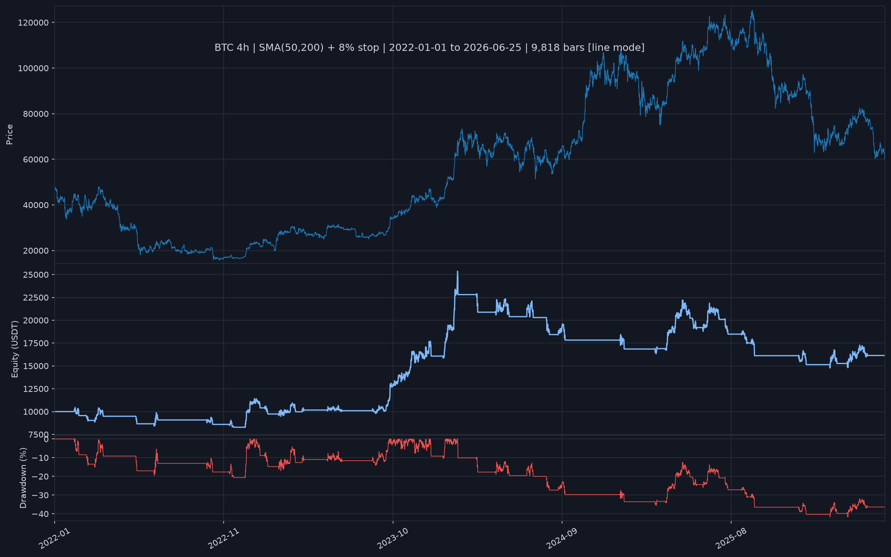

# BTC 4h Backtesting Engine

A correctness-first, event-driven backtesting engine for BTC 4h candles.
No lookahead bias. Honest fees. No backtesting libraries.

## Why event-driven, not vectorized?

Vectorized approaches (computing signals across the whole array at once) are faster
but make it easy to accidentally peek at future bars. This engine iterates bar-by-bar:
on bar `t`, the strategy literally cannot see bar `t+1` because the `Context` object
handed to it only contains rows `0..t`. Vectorizing for speed is a deliberate later
optimization once correctness is proven.

## Execution model

> **Signal on bar `t` -> fill at bar `t+1`'s OPEN price.**

A signal generated at bar `t`'s close is *queued* as a pending order and executed
at the very next bar's opening price. This reflects reality: you can't trade on a
candle until it's closed. This is the "next-bar open" fill rule.

## Setup (Windows PowerShell 5.1)

Commands must be run **one per line** — PowerShell 5.1 does not support `&&` chaining.

```powershell
# Navigate into the project directory first
cd btc-backtester

# Option A: uv (faster, recommended if installed)
uv venv .venv
.venv\Scripts\Activate.ps1
uv pip install -e ".[dev]"

# Option B: standard venv
python -m venv .venv
.venv\Scripts\Activate.ps1
pip install -e ".[dev]"
```

## Run a backtest

```powershell
# Default: BTCUSDT, 3-year range, SMA(50,200) with 8% stop, 10k USDT
python run.py

# Custom range and parameters
python run.py --start 2021-01-01 --end 2024-01-01 --fast 20 --slow 100 --stop 0.05
```

## Run tests

```powershell
pytest tests/ -v
```

## Defining a new strategy

Create a class in `strategies/` that inherits from `Strategy`:

```python
from strategies.base import Strategy
import pandas as pd

class MyStrategy(Strategy):
    def init(self, data: pd.DataFrame) -> None:
        # Called ONCE. Receives the full OHLCV DataFrame.
        # ONLY use this to precompute strictly backward-looking indicators.
        # Never use centered windows, forward fills, or any future-leaking transform.
        self.sma = data["close"].rolling(20).mean()

    def on_bar(self, context) -> None:
        # Called once per bar. context is windowed to the current bar only.
        i = context.current_idx
        val = self.sma.iloc[i]
        if pd.isna(val):
            return  # warmup guard -- always check for NaN explicitly
        if context.close > val and not context.position.has_position:
            context.buy()
        elif context.close < val and context.position.has_position:
            context.close_position(reason="crossover")
```

Then pass it to `run_backtest()`.

## Sample results — SMA(50,200), 8% stop, 10k USDT

> **Representative run: 2022-01-01 to 2026-06-25 (4.5 years, 31 trades)**

| Metric | Value |
|---|---|
| Total Return | +61.42% |
| CAGR | 11.27% |
| Annualized Volatility | 25.03% |
| Sharpe Ratio | 0.55 |
| Max Drawdown | -41.75% |
| Max Drawdown Duration | 734 days |
| Win Rate | 38.71% |
| Avg Win / Avg Loss | +$1,784 / -$803 |
| Profit Factor | 1.40 |
| Exposure | 35.1% |

The chart uses a TradingView-style dark theme with three panels: BTC 4h price (top — candlesticks for ranges up to 90 days, a price line for longer ranges), equity curve in USDT (middle), and underwater drawdown as a percentage (bottom, red fill). Short-range runs show entry/exit triangle markers at actual fill prices; multi-year runs switch to line mode to avoid overplotting.



### Why earlier runs showed stronger numbers

A 2022-01-01 to 2024-06-01 subset of the same strategy produced +111% total return,
Sharpe 1.24, and max drawdown -20.7% — substantially better on every metric. That
window is not representative, and should not be quoted as "the" performance number.

What happened: the strategy caught the 2023-2024 BTC bull run almost perfectly. It sat
out most of the 2022 bear market (flat from ~$47k down to ~$16k), then re-entered in
January 2023 and rode two large trending moves — a +25% trade in Jan-Feb 2023 and a
+59% trade from September 2023 to January 2024 (+$5,979), followed immediately by a
+42% trade in the February-March 2024 rally (+$6,734). Those two trades alone account
for the bulk of the shorter window's gains.

The 2024-2026 period reversed much of this. After BTC's post-ATH oscillation began,
the strategy accumulated 14 additional trades with a negative net: repeated stop-outs
in the $60k-$110k range as price moved in both directions without sustaining a trend.
This is the whipsaw regime described in the limitations section. Equity peaked near
$24k in early 2024 and ground back to ~$16k by mid-2026.

The full 4.5-year run is harder to look at but more honest: it includes both the regime
the strategy is built for (trending) and the one it handles poorly (choppy). A Sharpe
of 0.55 and profit factor of 1.40 over that full period mean the strategy is still
positive-expectancy, but not a free lunch.

### Strategy performance across regimes

Same strategy, identical parameters, three different market conditions:

| Period | Regime | Total Return | Sharpe | Max Drawdown | Profit Factor | Trades |
|---|---|---|---|---|---|---|
| 2022-01-01 to 2024-06-01 | Trending | +111.0% | 1.24 | -20.7% | 3.11 | 17 |
| 2022-01-01 to 2026-06-25 | Mixed | +61.4% | 0.55 | -41.75% | 1.40 | 31 |
| 2018-08-01 to 2019-04-01 | Choppy/sideways | -4.87% | -0.23 | -11.47% | 0.42 | 4 |

The only variable across these three runs is the market regime — parameters, fees, and
logic are identical. A profit factor range of 0.42 to 3.11 on the same rules illustrates
the core lesson of trend-following: regime awareness matters more than parameter tuning,
because no parameter set makes a crossover strategy profitable in a directionless market.
This is precisely why walk-forward testing and regime detection exist — and why they are
correctly out of scope for this v1.

## Correctness guarantees

1. **No lookahead**: `Context._data = data.iloc[:t+1]` -- future rows are absent, not just hidden.
2. **Next-bar fill**: orders queue on bar `t`, fill at bar `t+1`'s open.
3. **Fees on every fill**: 0.1% per side by default; configurable via `--fee`.
4. **Slippage configurable**: `--slippage` in basis points; default 0.
5. **Warmup enforced**: strategy guards NaN explicitly; engine does not short-circuit.
6. **Force-close**: final bar position is closed at that bar's close, tagged `end_of_data`.
7. **Mark-to-market**: equity is recorded at every bar's close, not just at trade exits.

## V1 limitations (known, intentional)

- Long-or-flat only. No shorting, leverage, or margin.
- Single asset. No portfolio.
- No walk-forward analysis or parameter optimization.
- No intrabar stop (stop evaluates at close, exits at next open -- see `ma_crossover.py`).
- No web UI, no live trading.

### Strategy regime-dependence

The bundled SMA crossover is a trend-following strategy. It performs well in sustained
directional moves (strong bull or bear trends) because it catches the move early and
rides it. It struggles in sideways, choppy, or mean-reverting markets: price oscillates
around the moving averages without committing to a direction, producing rapid crossover
signals that enter and exit at nearly identical prices while each side pays fees. This
pattern of small repeated losses is called "whipsaw." The 8% drawdown stop limits
individual loss size but does not prevent whipsaw — it only caps how far a single bad
position can run. If you see a backtest period with many short trades (< 50 bars) and
near-zero or negative returns, that is likely a sideways regime, not a strategy bug.
